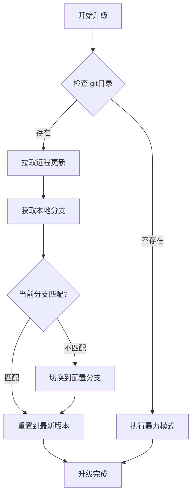
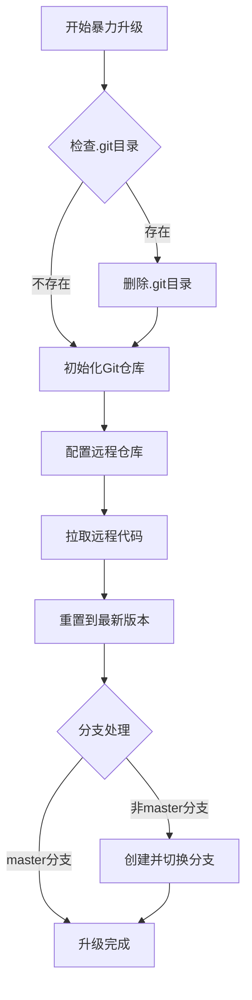

# Upgrade 组件

基于 Git 的自动化升级组件，提供两种升级模式：默认模式和暴力模式，用于从远程仓库同步代码。

## 概述

Upgrade 组件是一个智能的代码同步工具，专门用于从 Git 远程仓库自动拉取最新代码。它支持两种升级模式：

- **默认模式**：智能检测当前状态，进行增量更新
- **暴力模式**：强制重新初始化仓库，确保完全同步

## 功能特性

### 升级模式
- **默认模式**：智能检测 Git 仓库状态，进行安全更新
- **暴力模式**：强制重新初始化，解决复杂冲突问题

### Git 操作支持
- **仓库初始化**：自动初始化本地 Git 仓库
- **分支管理**：智能切换和创建分支
- **远程同步**：从远程仓库拉取最新代码
- **冲突解决**：自动处理常见的同步冲突

### 错误处理
- **详细日志**：提供详细的执行日志
- **错误检测**：自动检测并报告 Git 操作错误
- **安全退出**：遇到错误时安全退出程序

### 配置管理
- **灵活配置**：支持自定义远程仓库配置
- **路径验证**：自动验证执行路径的有效性
- **回调支持**：支持升级完成后的回调函数

## 安装指南

### 依赖要求

- Go 1.16+
- Git 命令行工具
- 网络连接（用于访问远程仓库）

### 系统要求

- 支持 Git 的操作系统（Linux, macOS, Windows）
- 对目标目录有读写权限
- 能够访问配置的远程仓库

## 使用示例

### 基本使用

#### 创建升级配置

```go
import "github.com/jcbowen/jcbaseGo/component/upgrade"
import "github.com/jcbowen/jcbaseGo"

// 创建升级配置
conf := jcbaseGo.RepositoryStruct{
    Dir:        "/path/to/your/project",
    RemoteURL:  "https://github.com/username/repository.git",
    RemoteName: "origin",
    Branch:     "main",
}

// 创建升级上下文
ctx := &upgrade.Context{
    Type: "default",
    Conf: conf,
}
```

#### 执行默认升级

```go
// 使用默认模式升级
upgrade.New(ctx).Do()

// 或者显式指定默认模式
upgrade.New(ctx).Default().Do()
```

#### 执行暴力升级

```go
// 使用暴力模式升级
upgrade.New(ctx).Hard().Do()
```

### 高级用法

#### 带回调函数的升级

```go
// 升级完成后执行回调函数
upgrade.New(ctx).Do(func() {
    fmt.Println("升级完成，开始执行后续操作...")
    // 执行重启服务、清理缓存等操作
})
```

#### 条件升级

```go
// 根据条件选择升级模式
if needForceUpgrade {
    upgrade.New(ctx).Hard().Do()
} else {
    upgrade.New(ctx).Default().Do()
}
```

#### 批量升级

```go
// 批量升级多个项目
projects := []jcbaseGo.RepositoryStruct{
    {
        Dir:        "/path/to/project1",
        RemoteURL:  "https://github.com/user/project1.git",
        RemoteName: "origin",
        Branch:     "main",
    },
    {
        Dir:        "/path/to/project2", 
        RemoteURL:  "https://github.com/user/project2.git",
        RemoteName: "origin",
        Branch:     "develop",
    },
}

for _, project := range projects {
    ctx := &upgrade.Context{
        Type: "default",
        Conf: project,
    }
    upgrade.New(ctx).Do()
}
```

## 详细功能说明

### 升级模式详解

#### 默认模式 (Default Mode)

默认模式是智能升级模式，它会：

1. **检查 Git 仓库状态**：检测是否存在 `.git` 目录
2. **拉取远程更新**：执行 `git fetch --all` 获取最新代码
3. **分支管理**：检查当前分支，必要时切换到配置的分支
4. **重置到最新版本**：执行 `git reset --hard` 同步到远程最新版本
5. **错误处理**：遇到错误时提供详细的错误信息

**适用场景**：
- 常规的代码更新
- 已经存在的 Git 仓库
- 需要保留本地配置的情况

#### 暴力模式 (Hard Mode)

暴力模式是强制升级模式，它会：

1. **清理现有仓库**：删除现有的 `.git` 目录（如果存在）
2. **重新初始化**：执行 `git init` 创建新的仓库
3. **配置远程仓库**：添加远程仓库地址
4. **拉取最新代码**：从远程仓库获取所有分支和标签
5. **强制同步**：重置到远程仓库的最新版本
6. **分支处理**：处理非 master 分支的特殊情况

**适用场景**：
- 仓库损坏或状态异常
- 需要完全重新同步
- 解决复杂的合并冲突
- 首次部署或迁移

### 配置结构

```go
type RepositoryStruct struct {
    Dir        string // 项目目录路径
    RemoteURL  string // 远程仓库 URL
    RemoteName string // 远程仓库名称（默认：origin）
    Branch     string // 分支名称（默认：master）
}
```

### 执行流程

#### 默认模式执行流程



#### 暴力模式执行流程



## 高级用法

### 集成到部署脚本

```go
// deploy.go - 自动化部署脚本
package main

import (
    "fmt"
    "github.com/jcbowen/jcbaseGo"
    "github.com/jcbowen/jcbaseGo/component/upgrade"
    "os/exec"
)

func main() {
    // 配置项目信息
    conf := jcbaseGo.RepositoryStruct{
        Dir:        "/var/www/myapp",
        RemoteURL:  "https://github.com/myorg/myapp.git",
        RemoteName: "origin",
        Branch:     "production",
    }
    
    ctx := &upgrade.Context{
        Type: "default",
        Conf: conf,
    }
    
    // 执行升级
    upgrade.New(ctx).Do(func() {
        fmt.Println("代码升级完成，开始重启服务...")
        
        // 重启服务
        cmd := exec.Command("systemctl", "restart", "myapp.service")
        if err := cmd.Run(); err != nil {
            fmt.Printf("重启服务失败: %v\n", err)
        } else {
            fmt.Println("服务重启成功")
        }
    })
}
```

### 定时升级任务

```go
// scheduler.go - 定时升级任务
package main

import (
    "fmt"
    "github.com/jcbowen/jcbaseGo"
    "github.com/jcbowen/jcbaseGo/component/upgrade"
    "time"
)

func scheduledUpgrade() {
    conf := jcbaseGo.RepositoryStruct{
        Dir:        "/path/to/project",
        RemoteURL:  "https://github.com/user/repo.git",
        RemoteName: "origin",
        Branch:     "main",
    }
    
    ctx := &upgrade.Context{
        Type: "default",
        Conf: conf,
    }
    
    for {
        fmt.Printf("[%s] 开始定时升级检查...\n", time.Now().Format("2006-01-02 15:04:05"))
        
        upgrade.New(ctx).Do(func() {
            fmt.Printf("[%s] 升级完成\n", time.Now().Format("2006-01-02 15:04:05"))
        })
        
        // 每隔1小时检查一次
        time.Sleep(1 * time.Hour)
    }
}
```

### 多环境配置

```go
// multi_env.go - 多环境配置管理
package main

import (
    "github.com/jcbowen/jcbaseGo"
    "github.com/jcbowen/jcbaseGo/component/upgrade"
    "os"
)

type EnvironmentConfig struct {
    Development jcbaseGo.RepositoryStruct
    Staging     jcbaseGo.RepositoryStruct
    Production jcbaseGo.RepositoryStruct
}

func getConfig(env string) jcbaseGo.RepositoryStruct {
    configs := EnvironmentConfig{
        Development: jcbaseGo.RepositoryStruct{
            Dir:        "./dev",
            RemoteURL:  "https://github.com/user/repo.git",
            RemoteName: "origin",
            Branch:     "develop",
        },
        Staging: jcbaseGo.RepositoryStruct{
            Dir:        "/srv/staging",
            RemoteURL:  "https://github.com/user/repo.git",
            RemoteName: "origin",
            Branch:     "staging",
        },
        Production: jcbaseGo.RepositoryStruct{
            Dir:        "/srv/production",
            RemoteURL:  "https://github.com/user/repo.git",
            RemoteName: "origin",
            Branch:     "main",
        },
    }
    
    switch env {
    case "development":
        return configs.Development
    case "staging":
        return configs.Staging
    case "production":
        return configs.Production
    default:
        return configs.Development
    }
}

func main() {
    env := os.Getenv("APP_ENV")
    if env == "" {
        env = "development"
    }
    
    conf := getConfig(env)
    ctx := &upgrade.Context{
        Type: "default",
        Conf: conf,
    }
    
    upgrade.New(ctx).Do()
}
```

## 性能优化建议

### 网络优化
- 使用国内镜像源加速 Git 操作
- 配置 Git 代理提高下载速度
- 使用 SSH 协议替代 HTTPS

### 磁盘优化
- 确保目标目录有足够的磁盘空间
- 定期清理旧的 Git 对象
- 使用浅克隆减少下载量

### 执行优化
- 批量操作时使用并发处理
- 合理设置超时时间
- 使用缓存减少重复下载

## 安全考虑

### 权限管理
- 确保对目标目录有适当的读写权限
- 使用最小权限原则
- 定期审查访问权限

### 仓库安全
- 验证远程仓库的可信度
- 使用 HTTPS 或 SSH 加密传输
- 定期更新 SSH 密钥

### 数据安全
- 重要数据备份后再执行升级
- 使用版本控制管理配置变更
- 记录升级操作日志

## 错误处理

### 常见错误及解决方案

#### Git 操作错误

```go
// 处理 Git 操作错误
func handleGitError(result string) {
    if strings.Contains(result, "fatal:") {
        // 解析具体的错误类型
        switch {
        case strings.Contains(result, "not a git repository"):
            fmt.Println("错误：目标目录不是 Git 仓库")
            // 建议使用暴力模式重新初始化
        case strings.Contains(result, "authentication failed"):
            fmt.Println("错误：认证失败，请检查仓库权限")
            // 建议检查 SSH 密钥或访问令牌
        case strings.Contains(result, "could not read"):
            fmt.Println("错误：无法读取远程仓库")
            // 建议检查网络连接和仓库地址
        default:
            fmt.Printf("Git 操作错误: %s\n", result)
        }
    }
}
```

#### 文件系统错误

```go
// 处理文件系统错误
func handleFileSystemError(err error) {
    if os.IsNotExist(err) {
        fmt.Println("错误：目标目录不存在")
    } else if os.IsPermission(err) {
        fmt.Println("错误：权限不足，无法访问目标目录")
    } else {
        fmt.Printf("文件系统错误: %v\n", err)
    }
}
```

### 错误恢复策略

1. **重试机制**：对网络相关的错误实现重试逻辑
2. **回滚策略**：重要操作前备份，失败时回滚
3. **降级方案**：升级失败时使用备用方案
4. **通知机制**：错误发生时及时通知管理员

## API 参考

### 主要函数

#### 上下文创建函数

- `New(option *Context) *Context` - 创建新的升级上下文
- `(op *Context) Hard() *Context` - 设置为暴力模式
- `(op *Context) Default() *Context` - 设置为默认模式

#### 执行函数

- `(op *Context) Do(callBack ...any)` - 执行升级操作

### 内部函数

#### 工具函数

- `checkGitDir(conf jcbaseGo.RepositoryStruct) bool` - 检查 Git 目录
- `hardUpgrade(conf jcbaseGo.RepositoryStruct)` - 暴力模式升级
- `defaultUpgrade(conf jcbaseGo.RepositoryStruct)` - 默认模式升级

### 配置结构

```go
type Context struct {
    Type string // 升级类型: hard, default
    Conf jcbaseGo.RepositoryStruct // 仓库配置
}

type RepositoryStruct struct {
    Dir        string // 项目目录
    RemoteURL  string // 远程仓库 URL
    RemoteName string // 远程仓库名称
    Branch     string // 分支名称
}
```

## 常见问题

### 升级失败常见原因

1. **网络问题**：无法访问远程仓库
2. **权限问题**：对目标目录没有写权限
3. **仓库状态**：本地仓库状态异常
4. **分支冲突**：分支切换冲突
5. **磁盘空间**：磁盘空间不足

### 性能问题

1. **下载缓慢**：配置 Git 镜像或代理
2. **内存占用**：大型仓库可能需要更多内存
3. **执行超时**：调整超时设置或分批处理

### 兼容性问题

1. **Git 版本**：确保使用兼容的 Git 版本
2. **操作系统**：不同系统可能有路径差异
3. **字符编码**：处理特殊字符的文件名

## 贡献指南

欢迎提交 Issue 和 Pull Request 来改进这个组件。

### 开发环境设置

1. 克隆项目仓库
2. 安装依赖工具
3. 运行测试用例
4. 提交代码变更

### 代码规范

- 遵循 Go 语言代码规范
- 添加必要的注释和文档
- 编写单元测试用例
- 确保向后兼容性

## 许可证

MIT License